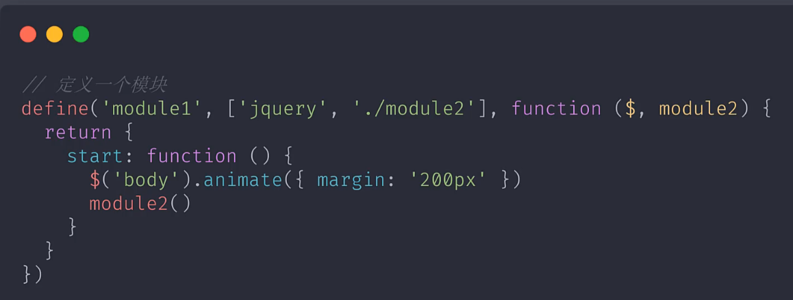
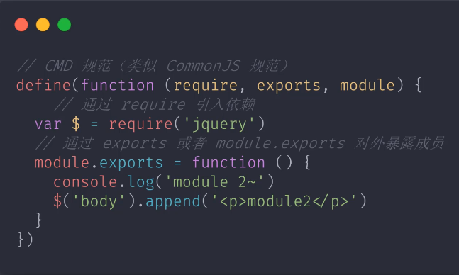

# 模块化开发与规范化标准

场景越来越复杂，模块化来组织代码。

## 模块化演变过程

### stage 1 - 文件划分方式

每个模块是单独的js文件

缺点： 
    - 污染全局作用域
    - 命名冲突
    - 无法管理模块依赖关系
    - 完全依靠约定
### stage2 - 命名空间的方式

在文件划分的基础上，把模块内的内容挂到一个对象上。可以解决命名冲突问题。但还是可以随意改变私有变量

```js
const moudle = {
    module1: xxx,
    module2: xxx
}
```

### stage3 - 立即执行函数

解决了私有成员和模块依赖问题

## 模块化规范

为了规范化，我们必须要有模块化标准和自动加载模块的库

### CommonJs 规范
nodejs中提出的标准。不适用于浏览器端。因为它是同步的方式加载模块，node是在启动时加载模块，执行过程中不会去加载模块，只会去使用模块。

约定：

    1. 一个文件就是一个模块
    2. 每个模块都有单独的作用域
    3. 通过module。exports导出模块
    4. 通过require函数载入模块

### AMD 规范

requireJs实现了AMD规范，且是个模块加载器。

- define 定义模块
- require 加载模块

是通过创建script标签去创建模块加载请求。




缺点：
    - AMD 使用相对复杂：除了业务代码，还需要使用define和require。
    - 模块JS 文件请求频繁：对于模块划分过细的项目，就会创建很多script，发送很多请求

### Sea.js + CMD



### 模块化标准规范
模块化的最佳实践

- nodejs：Commonjs
- 浏览器： ES Modules(es6)

### ES Modules

基本特性：

通过给script添加type=module的属性就可以以ES Module的标准执行其中的 JS 代码了

```html
<script type="module">
    // 1. 自动采用严格模式，忽略 'use strict'
    console.log(this);
    var foo = 100;
    console.log(foo);
</script>

<script type="module">
    // 2. 每个 ES Module都是运行在单独的私有作用域中
    console.log(foo); // undefined
</script>

<script type="module" src="xxx.jquery.js">
    // 3. ESM 通过 CORS 的方式请求JS 模块的, 非同源js的时候，需要服务端支持
</script>

<script type="module">
    // 4. ESM 的script的标签会延迟执行脚本，就是相当于自动添加了defer属性
</script>
```

ESM 的功能：
- 导入：import
- 导出：export

#### ESM 导出
```js
// module.js
// export var name = 'chloe';
// export function hello () {
//     console.log('hello');
// }

// export class Person {}

var name = 'chloe';
function hello () {
    console.log('hello');
}

class Person {}
// export { name, hello, Person }

export { // 这里的 {} 不是对象
    name as fooName, // 重命名
    hello as default, // 重命名为default的时候
}

export default name; // export default 后跟的是变量或者值
// import abc from './module.js'; // default 导入的时候，名称随意
``` 

```js
// index.js
// import { name } from './module.js';
import { fooName } from './module.js';
import { default as fooName } from './module.js';


console.log(name);
```

注意：

1. import {} 不是解构
2. export {} 中的{}不是字面量对象
3. export导出的是变量的引用(地址)。并不是值的拷贝。访问的是模块里定义变量的内存空间。
4. import导入的成员是只读成员

#### ESM 导入
 
- import 导入的时候文件名称必须完整，不能省略.js
- index.js 也不可以省略。不能只写到目录，要写完整。
- 我们使用打包工具的时候，扩展名可以省略
- 自定义的文件导入，需要用相对或者绝对路径，否则则以字母开头会以为是第三方模块。
- 直接执行模块：import 'xxx' 或者 import {} from 'xxx'
- 导入所有成员 import * as mod from './xxx.js'
- 异步动态加载模块 import('./xxx.js').then(), 返回的是 promise。
- import { name, age, default as title } from './xxx.js' 或者 import title, { name, age } from './xxx.js'

### ESM 导入导出成员

```js
export { foo, bar } from './ module.js';
```

### ESM 在浏览器的兼容性问题(polyfill)

IE 完全不支持。其他浏览器低版本的也不支持。

原理：将浏览器不识别的 ESM 通过babel转换，import进来的文件通过ajax去请求，然后babel再去转化。

存在的问题：对于支持ESM的浏览器文件会被执行2次。可以通过script标签的nomodule属性来解决。这个只适合开发阶段使用，生产阶段不适合，因为是运行时识别，性能低。

```js
// 只会对不支持ESM的浏览器执行
<script nomodule>
</script>
```

### ESM in Node.js

node >= 8.5 对esm是实验性支持的。 文件名需要是.mjs 结尾

Nodejs中的ESM 与commonJs：

ESM:

1. ESM 中可以导入CommonJS模块
2. 不能直接提取成员，注意import不是结构导出对象

CommonJs：

1. commonJS 模块始终只会导出一个默认成员
2. 不能在 CommonJs 模块中通过require载入 ESM模块

NodeJs中使用ESM与使用CommonJS的差异：

```js
// cjs.js

// 加载模块函数
console.log(require);

// 模块对象
console.log(module);

// 导出对象别名
console.log(exports);

// 当前文件的绝对路径
console.log(_filename);

// 当前文件所在的目录
console.log(__dirname);
```

```js
// esm.mjs
// ESM 中没有CommonJS中的那些模块成员了

console.log(import.meta.url); // 当前工作的文件的url地址

import { fileURLToPath } from 'url';

import { dirname } from 'path';

const __filename = fileURLToPath(import.meta.url);
const __dirname = dirname(__filename);

console.log(__filename, __dirname);
```

### ESM in Nodejs 新版本进一步支持(12.10.2)

```json
// package.json

{
    type: 'module' // 这样可以直接用 ESM 了，不需要命名为 .mjs
}
```

.js 文件如果用了commonJS的语法，会报require is not defined。 可以通过改文件为.cjs来解决

### esm in nodejs 使用babel做版本兼容

让我们在低版本node中也可以使用esm

```js
// 1. 安装模块 @babel/node
// 2. @babel/node 依赖 @babel/core @babel/preset-env, 所以这两个也得安装
// 3. yarn babel-node 命令看能否运行
// 4. yarn babel-node xx.js 会报错，不支持，需要我们去添加插件来实现转化
// 5. preset-env是插件的集合，包含了最新的js标准中的新特性
// 6. 可以这样设置：yarn babel-node index.js --presets-@babel/preset-env
// 7. 也可以这样用.babelrc
{
    "presets": ["@babel/preset-env"]
} 

// 8. preste-env是插件的集合，真正起作用的是插件，我们可以单独安装我们要使用的插件,比如：@babel/plugin-transform-mpdules-commonjs
{
    "plugins": [
        "@babel/plugin-transform-mpdules-commonjs"
    ]
}
// 9. 不支持的特性我们就用babel插件去处理

```

## 常用的模块化打包工具

为什么要使用模块化打包工具：
1. esm 存在环境兼容性问题
2. 模块化方式导致模块化文件过多，网络请求频繁
3. 所有的前端资源都需要模块化（js, css, image...）

作用： 
1. 新特性代码编译
2. 模块化js打包
3. 支持不同类型的资源模块

打包工具解决的是前端整体的模块化，并不单指js的模块化

## webpack

1. 安装webpack核心模块和webpack-cli模块为dev模块
2. `yarn webpack` 默认会从src/index.js 开始打包，默认生成 dist/main.js

### webpack 配置文件

运行于node环境。通过module.exports 导出一个对象

### webpack工作模式（mode 属性）

webpack4 增加了几种工作模式，可以简化我们的配置。就是几组预设的配置。

mode 的默认值是 production，会自动压缩代码等。

1. 命令行参数的方式修改mode
2. 在配置文件中加mode属性

```bash
# 
# 优化打包速度，方便调试
yarn webpack --mode development

# 原始打包，不做任何处理
yarn webpack --mode none 
```

### webpack 打包运行结果原理

1. 生成了一个立即执行函数。调用时传入了一个数组
2. 数组中的每一项是参数相同的函数，函数对应了源代码中的模块，实现了私有作用域

### webpack 资源模块加载

通过loader来实现非js资源文件的加载。

 css 文件，需要添加css-loader 和style-loader。 css-loader 的作用是把css文件当做js文件去加载，style-loader 的作用是把加载好的css文件用style标签的形式放到页面中去。

### webpack 导入资源模块

提倡在js中导入所有依赖的资源

### webpack 文件资源加载器

大多数资源都是跟css-loader一样，把css转化为js的方式去实现。但是有些资源文件，图片字体等无法通过js表示，我们需要用文件资源加载器file-loader

图片加载：webpack遇到图片文件，根据配置，匹配到file-loader。先将导入文件拷贝到输出目录，再将文件输出目录的路径作为当前模块的模块值返回。

### webpack URL 加载器

Data URLs: 当前URL就可以直接表示文件内容。请求这个文件的时候不回去发http请求。通过url-loader 实现

### webpack loader分类

1. 编译转换类： css-loder
2. 文件操作类型：file-loader
2. 代码质量检查：统一代码风格，eslint-loader

### webpack 与 es6
仅对模块进行打包，所以支持import和export。不支持es6

为了处理es6+， 所以需要添加bebel-loader和babel的核心依赖

### webpack加载资源的方式

兼容多种模块化标准

### 自定义一个loader

工作原理：从输入到输出的转化

loader是基于管道实现的，对于同一个资源可以依次使用多个loader。 css-loader + style-loader

### webpack 插件

增强webpack在项目自动化方面的能力，解决除了loader之外的其他自动化能力

### webpack 常用插件

1. 自动清除目录 clean-webpack-plugin

```js
const { CleanWebpackPlugin } = require('clean-webpack-plugin);
...
plugins: [
    new CleanWebpackPlugin()
]
```

2. 自动生成使用bundle.js 的HTML  html-webpack-plugin

作用：不需要同时发布html和dist；html中文件引用路径变化

```js
const HtmlWebpackPlugin = require('html-webpack-plugin');
...
plugins: [
    new HtmlWebpackPlugin()
]
```

### webpack html-webpack-plugin 优化

```js
// 传参数给页面
new HtmlWebpackPlugin({
    title: 'webpack plugin sample',
    meta: {
        viewport: 'width=device-width'
    }
})
```

```js
// 通过模板生成
new HtmlWebpackPlugin({
    title: 'webpack plugin sample',
    meta: {
        viewport: 'width=device-width'
    },
    template: './src/index.html',
})
```

### 同时输出多个页面文件

```js
// 用于生成index.html
new HtmlWebpackPlugin({
    title: 'webpack plugin sample',
    meta: {
        viewport: 'width=device-width'
    },
    template: './src/index.html',
}),
new HtmlWebpackPlugin({
    filename: 'about.html', // 生成的html文件名称
}),
```

### 不需要构建的静态文件  copy-webpack-plugin

```js
new CopyWebpackPlugin({
    patterns: [
        { from: 'public', to: 'public' },
    ],
}),
```

### 开发一个插件

Plugin 通过钩子实现，在webpack打包过程中，通过在生命周期的钩子中去挂载函数来实现扩展。

自定义插件必须是一个函数或者是一个包含apply方法的对象

### webpack 开发体验

以下模式效率低下：

编写代码-》webpack打包-》运行应用-》刷新浏览器

设想好的体验：

1. http服务运行
2. 自动编译和刷新浏览器
3. 提供source map支持，便于调试

下面我们就来实现他们
### webpack 自动编译 --watch

```bash
# 给源文件添加监听，自动编译
yarn webpack --watch
```

### 浏览器自动刷新  BrowserSync

```bash
# 监听dist文件变化
yarn browser-sync dist --files "**/*"
```

弊端：

1. 麻烦：需要同时启动2个服务
2. 开发效率低：webpack --watch不断写入磁盘，brower-sync不断地从磁盘取出

所以我们用 webpack dev server 来实现
### webpack dev server

```bash
yarn add webpack-dev-server --dev

yarn webpack-dev-server
# --open会自动打开浏览器
yarn webpack-dev-server --open
```

打包结果不会存入磁盘，是存到内存中。

### webpack dev server 静态资源访问

webpack-dev-server只会输出webpack打包后的文件。其他今天文件需要额外的配置。虽然前边我们提到了 CopyWebpackPlugin 可以拷贝额外的文件到dist，但是如果 额外的文件比较多，自动监听的情况下，就会大量频繁copy的情况，性能不佳。所以我们一般在 production 才使用 copy.

```js
devServer: {
    contentBase: './public',
},
```
### webpack dev server 代理 API

开发阶段接口跨域问题如何解决？

```js
devServer: {
    contentBase: './public', // 额外的需要监听的非webpack打包文件，因为CopyWebpackPlugin 是需要在production才使用的
    proxy: {
        '/api': { // http://localhost:8080/api/users -> https//api.github.com/users
            target: 'https://api.github.com',
            pathRewrite: {
                '^/api': '',
            },
            changeOrigin: true, // 不能使用localhost:8080 作为请求 GitHub 的主机名
        },
    },
},
```
### Source Map

代码被编译打包了，如果出问题了，怎么定位到源代码。source map可以~！！

.map 后缀的文件，就是source map文件，是json格式的，有几个主要的属性：

1. version：字符串，指的是当前这个文件使用的source map标准的版本
2. sources：数组，转化前源文件的名称，可能是多个文件合并为一个文件，所以是个数组
3. names：数组，源代码中使用的成员名称，
4. mappings: 核心属性， base64-LQ 编码的字符串。记录了转化后代码字符与转化前的映射关系

source map 主要运用于开发环境。是在打包后的代码中通过注释引入的。浏览器加载了打包后的代码后，会自动去加载引入的 source map
```js
// jquery-3.4.1.min.js
...
//# sourceMappingURL=jquery-3.4.1.min.map
```

### webpack 选择 source map 模式

可参考：

1. dev： cheap-module-eval-source-map
2. production: none

### webpack自动刷新的问题

不添加HMR的时候，添加 webpack-dev-server, 会导致每次修改代码页面刷新，这样页面就会出现状态丢失问题

### webpack HMR

问题：
1. HMR开启，代码出错的时候，浏览器会自动刷新（热更新回退为自动刷新），错误不容易被发现：可以使用hotOnly 替代hot
2. 没使用HMR的时候，不能使用 HMR API
3. 产生了很多额外的代码（）并不会影响生产环境，在生产环境会被删除掉

### 生产环境优化

mode

### webpack不同环境下的配置

两种方式：

1. 配置文件根据环境不同导出不同配置(中小型)
2. 一个环境对应一个配置文件（大型项目）

```js
// 1. 配置文件根据环境不同导出不同配置
// webpack.condig.js
module.exports = (env, argv) => {
    const config = {};
    if (env === 'production') {
        config.mode = 'production';
        config.devtool = false;
        ...
    }

    return config;
}
```

```js
// 2. 一个环境对应一个配置文件
// webpack.common.js   webpack.dev.js  webpack.prod.js 
```

### webpack DefinePlugin

为代码注入全局成员。

```js
new webpack.DefinePlugin({
    API_BASE_URL: '"https://api.example.com"'
})
```

### Tree Shaking

删除未引用代码。生产模式会自动开启。并不是指某一个webpack配置选项，而是一组功能搭配使用后的优化效果。

```js
optimization: { // 集中配置webpack内部优化功能
    usedExports: true, // 仅导出外部使用了的成员（枯树叶）
    minimize: true, // 压缩掉未被引用的代码（摇掉树叶）
}
```

### 合并模块
concatenateModules 尽可能将所有模块合并，并输出到一个函数中。即提升了运行效率，又减少了代码的体积
```js
optimization: { // 集中配置webpack内部优化功能
    usedExports: true, // 仅导出外部使用了的成员（枯树叶）
    minimize: true, // 压缩掉未被引用的代码（摇掉树叶）
    concatenateModules: true ,
}
```

### Tree-shaking & babel

babel-loader 的使用导致 tree-shaking 失效。 tree-shaking 需要我们的代码必须使用ESM

babel 一般会把 ESM 转换为 CommonJs。

解决：

1. 最新的babel-loader 现在关闭ESM 的转化标识
2. @babel/preset-env 也自动禁用了ESM的转化
、
### Webpack sideEffects

允许我们通过配置的方式去标识代码是否有副作用，为tree-shaking提供更大的压缩空间。

副作用： 模块执行时除了导出成员之外所做的事情

```js
optimization: { // 集中配置webpack内部优化功能
    sideEffects: true, // 开启 sideEffects 的功能
    usedExports: true, // 仅导出外部使用了的成员（枯树叶）
    minimize: true, // 压缩掉未被引用的代码（摇掉树叶）
    concatenateModules: true ,
}
``` 

### Webpack sideEffects 注意

要确保代码没有副作用

### webpack 代码分割 Code Splitting

应用启动时，不是所有的模块都需要立即加载。在浏览器运行时，会浪费流量和带宽。所以我们可以采用分包，按需去加载模块。

1. 多入口打包（根据业务模块）
2. 动态导入(ESM 按需加载)

### 多入口打包

一个页面对应一个入口

```js
// webpack.config.js

entry: {
    index: './src/index.js',
    album: './src/album.js',
},
output: {
    filename: '[name].bundle.js', // index.bundle.js  album.bundle.js
}

...
plugins: [
    // HtmlWebpackPlugin 会默认加载所有的打包结果
    new HtmlWebpackPlugin({
        title: 'Multi Entry',
        template: './src/index.html',
        filename: 'index.html',
        chunks: ['index'], // 指定只使用 index.bundle.js
    }),
    new HtmlWebpackPlugin({
        title: 'Multi Entry',
        template: './src/album.html',
        filename: 'album.html',
        chunks: ['album'], // 指定只使用 album.bundle.js
    }),
]
```

### 多入口处理公共模块

比如 juery、vue

```js
// webpack.config.js
optimization: {
    spliteChunks: {
        chunks: 'all',
    },
}
```

### webpack 动态导入

按需加载： 需要用到某个模块时，才去加载那个模块。

动态导入的模块会被自动分包

```js
const render = () => {
    const hash = window.location.hash || '#posts';

    const mainElement = document.querySelectot('.main')
    mainElement.innerHTML = '';

    if (hash === '#posts') {
        import('./posts/posts').then({ default: posts } => {
            mainElement.appendChild(post());
        })
    } else if (hash === '#album') {
        import('./album/album').then({ default: album } => {
            mainElement.appendChild(album());
        })
    }
}

render();

window.addEventListener('hasChange', render);
// 生成的文件会是 1.bundle.js 2.bundle.js 等
```

### webpack 魔法注释

为了使 1.bundle.js 更清晰，可以给动态导入的包命名。相同的名字会被打包到一起

```js
import(/* webpackChunkName: 'posts' */);
```
### 提取css到单独的文件 MiniCssExtractPlugin

可以通过这个插件实现css文件的按需加载。 css >= 150kb

之前使用的style-loader 是将样式通过style标签注入。这里用 MiniCssExtractPlugin 后就不需要用它了
```js
const MiniCssExtractPlugin = require('mini-css-extract-plugin');

...

module.exports = {
    module: {
        rules: [
            {
                test: /\.css$/,
                use: [
                    MiniCssExtractPlugin.loader,  // 通过link标签注入页面
                    'css-loader'
                ]
            }
        ]
    },
    plugins: [
        new MiniCssExtractPlugin(), // 这样配置后就可以自动把css提取为单独的文件
    ]
}

```

### webpack OptimizeCssAssetsWebpackPlugin

生产环境webpack 默认只压缩js，所以当我们单独提取css后，css不会被压缩

```js
const OptimizeCssAssetsWebpackPlugin = require('optimize-css-assets-webpack-plugin');
const TerserWebpackPlugin = require('terser-webpack-plugin');
module.exports = {
    module: {
        rules: [
            {
                test: /\.css$/,
                use: [
                    MiniCssExtractPlugin.loader,  // 通过link标签注入页面
                    'css-loader'
                ]
            }
        ]
    },
    plugins: [
        new MiniCssExtractPlugin(), // 这样配置后就可以自动把css提取为单独的文件
        // new OptimizeCssAssetsWebpackPlugin(), // 任何时候都会压缩css
    ],
    optimization: {
        minimizer: [ // 自定义使用的压缩器插件，问题：会覆盖自定义的js压缩插件
            new OptimizeCssAssetsWebpackPlugin(), // 只有开启 minimize 的时候才会压缩(生产环境默认开启)
            new TerserWebpackPlugin(),
        ]
    }
}
```
### Webpack 输出文件名 Hash

缓存静态资源，浏览器不需要再去请求。提高请求速度。

生产模式下，文件名使用hash，文件内容改变，hash值改变，这样就是全新的文件，可以设置足够长的缓存时间，不会出现缓存问题


hash:8 指定 hash 的长度
```js
new MiniCssExtractPlugin({
    filename: '[name]-[hash].bundle.css', // 项目级别的hash，任何文件改变，这个hash都会改变
    filename: '[name]-[chunkhash].bundle.css', // chunk hash，统一路的hash相同，只会影响同一个chunk
    filename: '[name]-[contenthash].bundle.css', // 文件级别的hash，根据文件内容生成的hash

})

```

## Rollup ESM 打包器

Rollup 比webpack更为小巧。仅有打包的功能。

## 模块化开发与规范化标准

### eslint

```bash
yarn add eslint --dev
```


### 